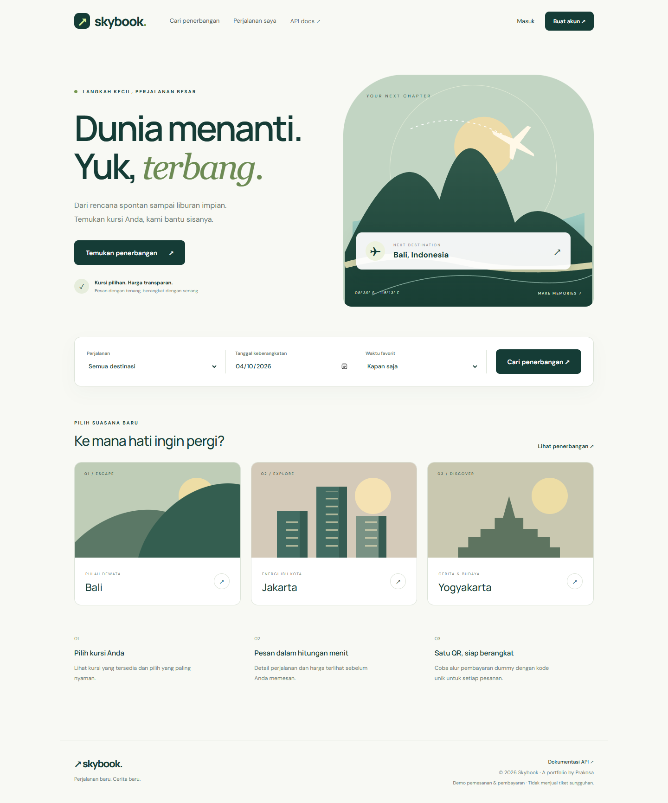

# Skybook — Flight Booking Portfolio

API pemesanan kursi pesawat dan UI responsif, dibuat oleh Prakosa Dwi Prasetya menggunakan **CodeIgniter 4.7.4, PHP 8.5.8, MariaDB 11.8 (Docker), JWT, dan Swagger/OpenAPI 3**.



## Fitur

- Register, login JWT (1 jam), logout dengan pencabutan token, profil, dan penghapusan akun.
- Lupa password dan reset satu kali pakai, berlaku 30 menit. Reset/perubahan password membatalkan JWT lama.
- Jadwal **09.00, 13.00, 15.00 WIB** setiap hari selama 30 hari: Garuda Indonesia, Batik Air, dan Citilink. Interpretasi jam `01` dan `03` pada PRD adalah siang/sore. Setiap jadwal memiliki 24 kursi (1A–4F).
- Daftar kursi tersedia dengan pagination serta filter tanggal, waktu, maskapai, kota asal, dan tujuan.
- Detail tiket, data penumpang, reservasi maksimal 15 menit, dan daftar metode pembayaran.
- QR pembayaran dummy dengan token acak 256-bit yang unik per booking. Scan/buka QR memanggil konfirmasi POST; kursi menjadi `closed` setelah pembayaran sukses. Konfirmasi berulang bersifat idempotent.
- Transaksi InnoDB dan row locking mencegah dua booking aktif pada kursi yang sama. Reservasi kedaluwarsa otomatis tidak menghalangi pemesanan berikutnya.
- UI terpisah: beranda, pencarian, register/login, reset password, checkout, perjalanan saya, profil, dan konfirmasi pembayaran.
- Swagger tersedia lokal tanpa CDN untuk aset dokumentasi.

**Demo portofolio:** penerbangan dan pembayaran merupakan simulasi, tanpa transfer uang atau penerbitan tiket maskapai sebenarnya.

## Jalankan di Windows

Prasyarat: PHP 8.5.8 yang sudah terpasang, Composer, Node.js, Git, serta Docker Desktop dengan Linux containers. Ekstensi PHP: `intl`, `mbstring`, `mysqli`, `pdo_mysql`, `xmlwriter`, `zip`; `sqlite3` untuk pengujian starter.

```powershell
cd D:\Repository\codeigniter
powershell -ExecutionPolicy Bypass -File scripts/setup.ps1
powershell -ExecutionPolicy Bypass -File scripts/start.ps1
```

Setup membuat konfigurasi PHP khusus proyek di `.runtime/php.ini`, membuat `.env` dengan rahasia acak jika belum ada, memasang dependency, menyalin Swagger, menarik image MariaDB, menunggu database sehat, menjalankan migration, dan seeder. Konfigurasi PHP global tidak perlu diubah. `.env` yang sudah ada dipertahankan.

| Layanan | Alamat |
| --- | --- |
| UI | http://localhost:8000 |
| Swagger | http://localhost:8000/docs |
| OpenAPI JSON | http://localhost:8000/openapi.json |
| MariaDB | `127.0.0.1:3307` |

Untuk server di latar belakang, tambahkan `-Background` pada `scripts/start.ps1`. PID dan konfigurasi lokal disimpan dalam `.runtime`, log ada di `writable/logs`. Server development PHP digunakan untuk demo lokal.

```powershell
# Menambah jadwal 30 hari dari hari ini; tidak menduplikasi jadwal sebelumnya
$env:PHPRC = (Resolve-Path .runtime/php.ini).Path
php spark db:seed FlightSeeder

# Mematikan database tanpa menghapus data
docker compose stop
```

Volume `skybook_data` mempertahankan database. Bila mengganti password `.env` setelah volume dibuat, sesuaikan juga password pengguna MariaDB; variabel inisialisasi Docker hanya dipakai pada volume baru.

## Instalasi manual / Linux

```bash
cp .env.example .env
# Isi JWT_SECRET (minimal 32 karakter), MARIADB_PASSWORD,
# MARIADB_ROOT_PASSWORD dan database.default.password (sama dengan MARIADB_PASSWORD).
composer install
npm ci
npm run assets
docker compose pull
docker compose up -d --wait
php spark migrate
php spark db:seed FlightSeeder
php spark serve --host 0.0.0.0 --port 8000
```

## Coba alur booking

1. Buka beranda lalu buat akun; data contoh tidak memuat akun/password bawaan.
2. Pilih tanggal (hari ini atau sampai 29 hari ke depan), maskapai, waktu, dan kursi.
3. Isi nama penumpang lalu buat reservasi.
4. Pilih QRIS, transfer bank, atau e-wallet; semua metode menggunakan simulasi konfirmasi QR.
5. Scan QR atau klik **Simulasikan scan QR**. Halaman konfirmasi menunjukkan pembayaran berhasil.
6. Buka **Perjalanan saya** untuk melihat booking terkonfirmasi. Kursi yang sudah dibayar tidak muncul lagi dalam pencarian.

QR menggunakan `app.baseURL`. Agar dapat dipindai dari ponsel, ubah `.env` ke IP LAN komputer, misalnya `http://192.168.1.10:8000/`, restart server, lalu login ulang. Ponsel harus terhubung pada jaringan yang sama dan port 8000 dapat dijangkau. `localhost` hanya menunjuk perangkat yang membuka QR.

## API

Semua body mutasi menggunakan `Content-Type: application/json`. JWT dikirim dalam header `Authorization: Bearer <token>`. Masukkan token dari register/login pada tombol **Authorize** di Swagger.

| Metode | Endpoint | Fungsi | JWT |
| --- | --- | --- | --- |
| POST | `/api/auth/register` | Daftar akun | — |
| POST | `/api/auth/login` | Login | — |
| POST | `/api/auth/forgot-password` | Minta reset password | — |
| POST | `/api/auth/reset-password` | Reset password sekali pakai | — |
| POST | `/api/auth/logout` | Cabut token akun | Ya |
| GET / PATCH / DELETE | `/api/users/me` | Baca, ubah, hapus profil sendiri | Ya |
| GET | `/api/airlines` | Maskapai dengan kursi tersedia | — |
| GET | `/api/tickets` | Kursi tersedia per tanggal | — |
| GET | `/api/tickets/{id}` | Detail tiket dan metode pembayaran | — |
| GET / POST | `/api/book` | Riwayat / buat booking | Ya |
| GET | `/api/book/{id}` | Detail booking sendiri | Ya |
| POST | `/api/pay` | Buat token pembayaran unik | Ya |
| GET | `/api/pay/{id}/barcode` | QR SVG untuk booking sendiri | Ya |
| POST | `/api/payments/{token}/confirm` | Konfirmasi dummy dari QR | Token QR |

Contoh filter: `/api/tickets?date=2026-10-05&time=13:00&airline=Batik%20Air&page=1&per_page=12`. `per_page` maksimal 60, `page` maksimal 10000. Jadwal yang sudah berangkat tidak ditampilkan.

Login digunakan untuk autentikasi. Pembaruan profil sesuai endpoint terpisah pada PRD dilakukan melalui `PATCH /api/users/me`. Password baru memerlukan `current_password`; penghapusan akun memerlukan `password`.

## Keamanan dan batas demo

- Password di-hash; reset token disimpan sebagai SHA-256; JWT diperiksa algoritma, issuer, audience, masa berlaku, dan versi token pengguna.
- Booking dan QR hanya dapat dibaca oleh pemilik. Endpoint konfirmasi memakai token QR sebagai rahasia akses agar dapat dipindai tanpa login. Token tidak ditampilkan pada riwayat booking.
- Pembatasan permintaan: 20 per menit per IP untuk autentikasi, 120 untuk API lainnya. Respons API tidak disimpan dalam cache.
- Menghapus akun membatalkan reservasi pending. Riwayat transaksi yang sudah dibayar dipertahankan; kursi tersebut tetap tertutup.
- `app.demo = true` hanya di development: API lupa password mengembalikan `demo_reset_url` supaya alur dapat dicoba tanpa SMTP. Untuk penggunaan selain demo lokal, set `app.demo = false`, `CI_ENVIRONMENT = production`, HTTPS, rahasia sendiri, dan konfigurasi SMTP pada `.env.example`. Respons lupa password tidak mengungkap apakah email terdaftar saat mode demo dimatikan.
- Font UI dimuat dari Google Fonts dengan fallback lokal; fungsi aplikasi tetap berjalan tanpa koneksi font. Swagger dan QR menggunakan aset/paket lokal.

## Pengujian

Jalankan aplikasi dan database terlebih dahulu. Pengujian HTTP menggunakan database demo, membuat pengguna sementara, dan melakukan pembayaran dummy yang mempertahankan kursi tertutup sebagai riwayat. Gunakan database khusus demo/pengujian.

```powershell
$env:PHPRC = (Resolve-Path .runtime/php.ini).Path
php vendor/bin/phpunit --no-coverage
npm.cmd run test:api
npm.cmd run test:ui
```

Pengujian browser Windows memakai Microsoft Edge headless. Override lewat `TEST_BROWSER_CHANNEL` bila diperlukan. Di Linux, pasang Chromium Playwright dengan `npx playwright install --with-deps chromium`. Screenshot pengujian tersimpan di `test-results/` dan tidak masuk Git.

Validasi implementasi: 63 pemeriksaan HTTP, pengujian reservasi dari dua proses PHP bersamaan, reservasi kedaluwarsa, kepemilikan booking/QR, pencabutan token, reset sekali pakai, QR benar-benar didekode, alur UI sampai pembayaran, Swagger, serta pemeriksaan overflow pada layar 390 px. Lima pengujian starter PHPUnit juga lulus.

## Struktur

```text
app/Controllers/       API autentikasi, penerbangan, dan halaman
app/Libraries/         JWT, transaksi booking/pembayaran, OpenAPI
app/Filters/           JWT, validasi JSON, dan rate limiting
app/Database/          Migration dan seed jadwal
app/Views/skybook/     Halaman HTML dan Swagger
public/assets/        CSS, JavaScript, dan Swagger lokal
scripts/              Setup, server, dan penyalinan aset
tests/                Pengujian HTTP, konkurensi, browser, dan PHPUnit
compose.yaml          MariaDB dan volume persistent
```

Rahasia `.env`, dependensi, cache, log, konfigurasi lokal, dan materi email lamaran tidak dikirim ke GitHub. Proyek ini mengikuti starter CodeIgniter dengan lisensi MIT.
